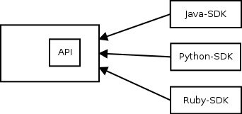
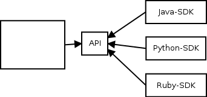

Few weeks ago I have attended a session on the new API specification in oVirt. While the motivation was well explained and the overall design of the solution made a lot of sense, the presented language made me wonder whether it is the best *language* for the problem at hand. In this post I argue we can achieve a better language for the API specification in oVirt by using an external DSL rather than internal DSL.  

# Background
Lets start with a brief overview of what domain-specific language are, the difference between internal and external domain-specific languages and the tools available today for creating and using external domain-specific languages.

## Domain Specific Language
Doman specific language (DSL) is a programming language that is tailored to a particular problem domain. Unlike general purpose language (such as Java, C, C#), DSL does not aim at being turing-complete. It provides syntax that is typically more declarative, concise and restrictive at the expense of reusability.  

The concept of DSLs is not new. Most probably, if you are a developer you programmed with some DSL in the past. Some notable examples of DSLs are: HTML for creating webpages, SQL for interaction with databases and MATLAB for matrix programming.  

## Internal vs External DSL
Martin Fowler [noted two types of DSLs](http://martinfowler.com/books/dsl.html): internal and external. Internal DSL is a particular form of API in a host general purpose language (An example is fluent API/interface), while external DSL is parsed independently of the host general purpose language.  

There is a clear trade-off between using internal and external DSL. On the one hand, it is generally easier to create internal DSLs since one leverages the parser and compile tools of the host language. Moreover, one can leverage editing tools for the host language while programming with an internal DSL. On the other hand, internal DSLs are limited by the syntax and structure of the host language, which often results in more complicated languages to program with compared to external DSLs.  

## Language Workbench
Fowler noted language workbenches (LWs) as a possible [killer-app for DSLs](http://www.martinfowler.com/articles/languageWorkbench.html). These are tools that address the Achilles' heel of external DSLs by facilitating their creation and use.  

Today, LWs are typically based on mainstream IDEs and provide one with tool support for the grammar definition of the DSL using some grammar definition format (that parser and editing tools are generated from) and for the definition of the semantics of the DSL using some code transformation format (so DSL code could be transformed into code in a general purpose language in order to leverage the compilation tools of the latter).  

Some notable production-ready language workbenches that are available today are: [Xtext](http://www.eclipse.org/Xtext/) and [Spoofax](http://metaborg.org) that are based on Eclipse and [MPS](https://www.jetbrains.com/mps/) that is based on IntelliJ. I find Xtext to be the most practical LW nowadays among the ones mentioned above thanks to its ability to generate plugins for programming with the DSL in both Eclipse and IntelliJ, the [integration one can achieve with Java](https://eclipse.org/Xtext/documentation/305_xbase.html) and the fact it is not make use of [projectional editing](http://martinfowler.com/bliki/ProjectionalEditing.html).  

# Problem
The problem we were trying to solve in oVirt 4.0 was comprised of two parts:

## Dependencies
oVirt provides several software development kits (SDKs) for different languages: Java, Python and recently also for Ruby. These SDKs interact with oVirt-engine through REST-API interface.  

Previously, the specification of the REST-API interface was integrated in the oVirt-engine project (figure 1). That lead to two issues. First, SDKs were depended on fat artifacts that contained more than just the specification. Second, we could publish these artifact only when new version of oVirt-engine was released.  

  
Figure 1: Architecture with oVirt API v3


## Documentation
While it was possible to document the specification on top of the Java implementation of the REST-API interface using javadoc, there were many parts missing or not up-to-date.  

# Current Solution based on Internal DSL
The solution that was presented in version 4 of the API was comprised on two parts. First, there is an architecural design change. The specification of the API was extract into a separate project. The use of a separate project with its own source code repository allows other projects, like the SDKs, to depend only on the specification artifact (figure 2) and allows to publish new versions of the API specification independently. This solves the first part of the problem related to dependencies.  

  
Figure 2: Architecture with oVirt API v4

Second, a new language is introduced in order to express the specification of the API. This language is an internal DSL with Java as the host language.

In this language data types are represented by Java interfaces with documentation placed using Javadoc comment. For example, the `Vm.java` file contains the specification of the `Vm` entity, which looks like this:  

```java
/**
 * Represents a virtual machine.
 */
@Type
public interface Vm extends VmBase {
   /**
     * Contains the reason why this virtual machine was stopped. This reason is
     * provided by the user, via the GUI or via the API.
     */
    String stopReason();
    Date startTime();
    Date stopTime();
    ...
}
```
Services are represented in a similar way:  

```java
/**
 * This service manages a specific virtual machine.
 */
@Service
public interface VmService extends MeasurableService {

    /**
     * This operation will start the virtual machine managed by this
     * service, if it isn't already running.
     */
    interface Start {
        /**
         * Specifies if the virtual machine should be started in pause
         * mode. It is an optional parameter, if not given then the
         * virtual machine will be started normally.
         */
        @In Boolean pause();
        ...
    }
    ...
}
```

More about the current language used can be found [here](https://github.com/oVirt/ovirt-engine-api-model/blob/master/README.adoc).

# Enhanced Solution with External DSL
The solution proposed in this post leaves the first part, the architectual design change, as is. That is, the API specification stays as a separate project. The difference is in the second part, namely the language introduced for the API specification, where external DSL is used rather than internal DSL.  

An example for how to define `VM` entity mentioned above with an external DSL:  

```
'Represents a virtual machine.'
Type Vm : VmBase {
'Contains the reason why this virtual machine was stopped.
 This reason is provided by the user, via the GUI or via the API'
stopReason :: String;

TODO
startTime :: Date;

TODO
stopTime :: Date;
...
}
```

And `VmService` can be defined like this:  

```
"This service manages a specific virtual machine."
Service VmService : MeasurableService {
	"This operation will start the virtual machine managed by this
     service, if it isn't already running."
	Start {
		"Specifies if the virtual machine should be started in pause
         mode. It is an optional parameter, if not given then the
         virtual machine will be started normally."
		In paused :: Boolean;
	}
	...
}
```

These code quotes could make you underestimate the effectiveness of programming with such a language due to the lack of support by Github's markdown format for the presented language. IDE plugins, in contrast, provide the developer with the standard editing tools available today like auto-completion and text-highlighting. The next video demonstrates how part of `VmService` shown above was written in Eclipse:  

<a href="http://www.youtube.com/watch?feature=player_embedded&v=PQgsuF9CvOQ" target="_blank"></a>  

The language definition can be found [here](https://github.com/ahadas/ovirt-engine-api-lang/blob/master/org.ovirt.api.model/src/org/ovirt/api/model/Spec.xtext). The language is defined in the grammar definition format provided by Xtext. For more details about this format and Xtext in general see [the documentation on eclipse.org](https://eclipse.org/Xtext/documentation/index.html).  

As a proof of concept, the `Vm` entity and `VmService` service were transformed into their Java counterparts mentioned before. This transformation that was written in Xtend, a programming languages provided by Xtext, can be found [here](https://github.com/ahadas/ovirt-engine-api-lang/blob/master/org.ovirt.api.model/src/org/ovirt/api/model/generator/SpecGenerator.xtend). Note that in production it would be better to transform them directly into the target representation of the specification without the transformation into the internal DSL. The full definition of `Vm` and `VmService` can be found [here](https://github.com/ahadas/ovirt-engine-api-model/blob/master/ovirt-engine-api-model/src/Vm.ospec) and [here](https://github.com/ahadas/ovirt-engine-api-model/blob/master/ovirt-engine-api-model/src/VmService.ospec) (and the generated [here](https://github.com/ahadas/ovirt-engine-api-model/blob/master/ovirt-engine-api-model/src-gen/types/Vm.java) and [here](https://github.com/ahadas/ovirt-engine-api-model/blob/master/ovirt-engine-api-model/src-gen/services/VmService.java)).

# Discussion
<!-- documentation guys do not need to know java -->
<!-- Boilerplate_code -->

# Conclusion
The advanced language workbenches available today greatly improve the attractiveness of external DSLs. One is able to program with languages that typically better fit for the problems at hand compared to general purpose language and internal DSLs, and without suffering from the traditional high effort that was needed for creating them and lack of tools for programming with them.  

I believe that the use of external DSL for the API specification in oVirt, as the one presented in this post, can be cost-effective and take the improvements presented in version 4 of the API specification one step forward into an even better solution. 