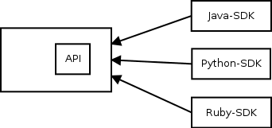
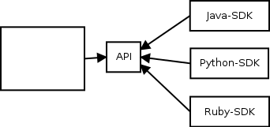

Few weeks ago I attended a session on the new API specification in oVirt. While the motivation was well explained and the overall design of the solution made a lot of sense, the presented language made me wonder whether it is the best *language* for the problem at hand. In this post I argue we can achieve a better language for the API specification in oVirt by using an external DSL rather than internal DSL.  

# Background
Lets start with a brief overview of what domain-specific languages are, the difference between internal and external domain-specific languages and describe tools that are available today for creating and using external domain-specific languages.

## Domain Specific Language
Doman specific language (DSL) is a programming language that is tailored to a particular problem domain. Unlike general purpose language (such as Java, C, C#), DSL does not aim at being turing-complete. It generally provides syntax that is more declarative, concise and restrictive at the expense of reusability.  

The concept of DSLs is not new. Most probably, if you are a developer you have already programmed with a DSL. Some notable examples of DSLs are: HTML for creating webpages, SQL for interaction with databases and MATLAB for matrix programming.  

## Internal vs External DSL
Martin Fowler [distinguishes between two types of DSLs](http://martinfowler.com/books/dsl.html): internal and external. Internal DSL is a particular form of API in a host general purpose language (e.g., fluent API), while external DSL is parsed independently and not as part of a host language.  

There is a clear trade-off between using internal and external DSLs. On the one hand, it is generally easier to create internal DSLs since one can leverage the parser and compilation tools of the host language. Moreover, one can leverage editing tools intended for the host language while programming with the internal DSL. On the other hand, internal DSLs are limited by the syntax and structure of the host language, which often results in more complicated languages to program with compared to external DSLs.  

## Language Workbench
Fowler noted language workbenches (LWs) as a possible [killer-app for DSLs](http://www.martinfowler.com/articles/languageWorkbench.html). These are tools that address the Achilles' heel of external DSLs by facilitating their creation and use.  

Today, LWs are typically based on mainstream IDEs and provide one with tool support for the grammar definition of the DSL using some grammar definition format (that parser and editing tools are generated from) and for the definition of the semantics of the DSL using some code transformation format (so DSL code could be transformed into code in a general purpose language in order to leverage the compilation tools of the latter).  

Some notable production-ready language workbenches that are available today are: [Xtext](http://www.eclipse.org/Xtext/) and [Spoofax](http://metaborg.org) that are based on Eclipse and [MPS](https://www.jetbrains.com/mps/) that is based on IntelliJ. I find Xtext to be the most practical LW nowadays among the ones mentioned above thanks to its ability to generate plugins for programming with the DSL in both Eclipse and IntelliJ, the [integration one can achieve with Java](https://eclipse.org/Xtext/documentation/305_xbase.html) and the fact that it does not make use of [projectional editing](http://martinfowler.com/bliki/ProjectionalEditing.html).  

# Problem
A problem we were trying to solve in oVirt 4.0 was comprised of two parts:

## Dependencies
oVirt provides several software development kits (SDKs) for different languages: Java, Python and recently also for Ruby. These SDKs interact with oVirt-engine, the central management unit, through REST-API interface.  

Previously, the specification of the REST-API interface was integrated in the oVirt-engine project (figure 1). That lead to two issues. First, SDKs were depended on a fat artifact that contained more than just the specification. Second, we could publish this artifact only when new version of oVirt-engine was released.  

  
Figure 1: Architecture with oVirt API v3


## Documentation
While it was possible to document the specification on top of the Java implementation of the REST-API interface using Javadoc, many parts were missing or not up-to-date.  

# Current Solution based on Internal DSL
The solution that was presented in version 4 of the API was comprised of two parts. First, there was an architecural design change. The specification of the API was extracted into a separate project. The use of a separate project with its own source code repository allows other projects, like the SDKs, to depend only on the specification artifact (figure 2) and allows to publish new versions of the API specification independently. This solves the first part of the problem related to dependencies.  

  
Figure 2: Architecture with oVirt API v4

Second, a new language was introduced to express the API specification with in order to ease its documentation. This language is an internal DSL with Java as the host language.

In this language data types are represented by Java interfaces and documentation is provided in the form of Javadoc comment. For example, the `Vm.java` file contains the specification of the `Vm` entity, which looks like this:  

```java
/**
 * Represents a virtual machine.
 */
@Type
public interface Vm extends VmBase {
   /**
     * Contains the reason why this virtual machine was stopped. This reason is
     * provided by the user, via the GUI or via the API.
     */
    String stopReason();
    Date startTime();
    Date stopTime();
    ...
}
```
Services are represented in a similar way:  

```java
/**
 * This service manages a specific virtual machine.
 */
@Service
public interface VmService extends MeasurableService {

    /**
     * This operation will start the virtual machine managed by this
     * service, if it isn't already running.
     */
    interface Start {
        /**
         * Specifies if the virtual machine should be started in pause
         * mode. It is an optional parameter, if not given then the
         * virtual machine will be started normally.
         */
        @In Boolean pause();
        ...
    }
    ...
}
```

More about the current language can be found [here](https://github.com/oVirt/ovirt-engine-api-model/blob/master/README.adoc).

# Enhanced Solution with External DSL
The solution proposed in this post leaves the first part, the architectual design change, as is. That is, the API specification stays as a separate project. The difference is in the second part, namely the language introduced for the API specification, where external DSL is used rather than internal DSL.  

An example for how to define the `VM` entity mentioned before with an external DSL:  

```
'Represents a virtual machine.'
Type Vm : VmBase {
'Contains the reason why this virtual machine was stopped.
 This reason is provided by the user, via the GUI or via the API'
stopReason :: String;

TODO
startTime :: Date;

TODO
stopTime :: Date;
...
}
```

And `VmService` can be defined like this:  

```
"This service manages a specific virtual machine."
Service VmService : MeasurableService {
"This operation will start the virtual machine managed by
 this service, if it isn't already running."
Start {
"Specifies if the virtual machine should be started in pause
 mode. It is an optional parameter, if not given then the
 virtual machine will be started normally."
In paused :: Boolean;
}
...
}
```

These code quotes could make you underestimate the effectiveness of programming with such a language due to the lack of support by Github's markdown format for the presented language. IDE plugins, in contrast, provide the developer with the standard editing tools that are available today like auto-completion and text-highlighting. The next video demonstrates how part of the `VmService` shown above was written in Eclipse:  

<a href="http://www.youtube.com/watch?feature=player_embedded&v=PQgsuF9CvOQ" target="_blank"></a>  

The language definition can be found [here](https://github.com/ahadas/ovirt-engine-api-lang/blob/master/org.ovirt.api.model/src/org/ovirt/api/model/Spec.xtext). The language is defined in the grammar definition format provided by Xtext. For more details about this format and Xtext in general see [the documentation on eclipse.org](https://eclipse.org/Xtext/documentation/index.html).  

As a proof of concept, the `Vm` entity and `VmService` were transformed into their implementation in the internal DSL shown before. This transformation that was written in Xtend, a programming language provided by Xtext, can be found [here](https://github.com/ahadas/ovirt-engine-api-lang/blob/master/org.ovirt.api.model/src/org/ovirt/api/model/generator/SpecGenerator.xtend). Note that in production it would be better to transform them directly into the target representation of the specification without the transformation into the internal DSL. The full definition of `Vm` and `VmService` can be found [here](https://github.com/ahadas/ovirt-engine-api-model/blob/master/ovirt-engine-api-model/src/Vm.ospec) and [here](https://github.com/ahadas/ovirt-engine-api-model/blob/master/ovirt-engine-api-model/src/VmService.ospec) (and the generated [here](https://github.com/ahadas/ovirt-engine-api-model/blob/master/ovirt-engine-api-model/src-gen/types/Vm.java) and [here](https://github.com/ahadas/ovirt-engine-api-model/blob/master/ovirt-engine-api-model/src-gen/services/VmService.java)).

# Why is External DSL Better
So what is the big deal between using the internal DSL vs using the external DSL you may ask. Their syntax is quite similar and the latter does not provide one with the ability to express something he cannot express with the former. I will point out the benefits of using the external DSL by addressing things that came up in the session I mentioned at the beginning and from my own experience with working with both languages.  

The argument for basing the presented language on Java (which makes it an internal DSL) was to make it possible to leverage Java tools. But as we have seen before, the same capabilities can also be achieved for an external DSL by using a language workbench.  

In the mentioned session one asked whether the language itself or the tools developed for it (for its transformation I believe) can be reused by other projects. The answer was positive. Questions about reuse are often raised in order to find a way to reduce the amortized development cost. However, when using a proper language workbench, one uses third-party tools for the language definition and its transformation that significantly simplify the language development, making it (typically) cost-effective even for one-time use. By taking reusability out of the equation, the language can be kept minimal and optimal for the particular instance of the problem at hand.  

The presenter showed an example for adding a color to the `Vm` entity. One guy asked if we can use the type `byte` for the RGB values of the color instead of an `int`. The answer was negative. This is an example for the downside of basing the language on Java - one may try to use any type provided by Java, even unexpected ones. In contrast, the external DSL provides only the supported types. Note: yet, one can easiliy define that a particular field can be of any Java type, if needed.  

That example exposed another downside of the internal DSL. The presenter typed most of the definition of the color without specifying a comment for that field. Then he asked "is something missing?" and although that question seemed suspicious, most of the crowd answered that nothing is missing. Documentation in the form of Javadoc is optional and is easy to forget. The fact that documentation in the internal DSL is provided as Javadoc could make one reach the code review phase without the required documentation and the reviewer can easily miss it. In the external DSL, however, documentation is part of the language and thus lack of documentation will produce an error by the IDE (without any checkstyle or other plugin), making it impossible to forget to document.  

Another question was: why should we use the `@Type` and `@Service` annotations while we can retrieve that information from the package the file is located in (either `types` or `services`)? I think this question can be generalized to: how can we reduce the boilerplate code? Looking at code written in the internal DSL, we see a redundant syntax that is repeated again and again: the visibility of the types and services, the `interface` keyword near every action in a service, empty parenthesis near every property of a data type and so on. In contrast, we see much less boilerplate code in one written in the external DSL.  

Moreover, having the language less coupled with Java makes it easier to work with for non-programmers. Typically, ones that mainly work on documentation are not programmers. Simplifying the grammar and making it more declarative (specifically the documentation part as we will discuss next) makes it easier for them to contribute.  

And lastly, besides being optional, the fact that Javadoc comments have no clear structure makes it difficult to understand the expected format of the documentation. For example, one is expected to write the date and status of a comment he adds/modifies. It is easy to forget to write the date and unless the reviewer catches it, documentation can be merged without specifying its date or when it is typed incorrectly (having @data instead of @date for instance). As for the status, not only that it is easy to forget to specify it, it is unclear what are its allowed values since it is a free text. Unlike the internal DSL, the external DSL provides a clear structure for documentation as part of the language, enforcing developers to provide all the required values and reduce the chance for issues that are caused by typos. An example for a structured documentation in the external DSL:

```
summary: 'This operation stops any migration of a virtual machine to another physical host.'
description: '
[source]
----
POST /ovirt-engine/api/vms/123/cancelmigration
----

The cancel migration action does not take any action specific parameters,
so the request body should contain an empty `action`:

[source,xml]
----
<action/>
----
'
author: 'Arik Hadas <ahadas@redhat.com>'
date: '14 Sep 2016'
status: added
CancelMigration {
 'Indicates if the migration should cancelled asynchronously.'
 In async :: Boolean; 
}
```

One downside of using an external DSL is that it means to require contributers to use an IDE plugin for programming with the external DSL. On the other hand, language workbenches like Xtext are able to produce plugins for mainstream IDEs and mechanisms like Eclipse's update-site can simplify the installation of such plugins.  

# Conclusion
The advanced language workbenches that are available today greatly increase the attractiveness of external DSLs. One is able to program with languages that typically better fit for the problems at hand compared to general purpose languages and internal DSLs without the high effort that was traditionally needed in order to create them and program with them due to lack of tools.  

This post presents an external DSL for the API specification of oVirt that was partially implemented using the Xtext language workbench. Hopefully this post would interest people that work on oVirt's API specification and push them toward giving a chance for such a language instead of the internal DSL that was introduced in oVirt 4.0.
