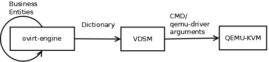
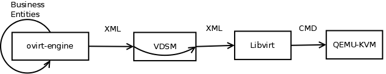
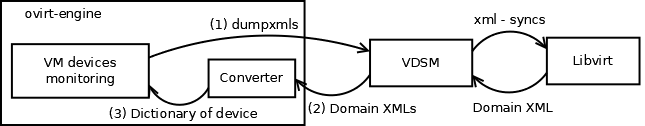

When I was a kid we used to play this game in which someone though about a message and told it to his friend. The latter told the message he heard to another kid, and so on. Eventually, we were amused to see the difference between the original message and the one that the last kid has heard. This post describes our approach for addressing a similar problem that was caused by having too many abstraction layers in oVirt. Each layer converted its input in order to report it to the next layer "in its own words", resulting in cumbersome and error-prone business flows in our platform.

# Background
oVirt was originated from a management platform developed by a [startup company that created the KVM hypervisor](https://en.wikipedia.org/wiki/Qumranet). Back at its early days, not only that the technology it was implemented in was different than the one we use today, but also its design was different than its current design.

Initially, the agent that resides on the distributed hosts (VDSM) was expected to interact directly with the hypervisor. Another protocol was defined for the communication between the central management unit (called ovirt-engine nowadays) and VDSM.

Consequently, flows that included interaction with the hypervisor required two conversions. Figure 1 depicts such a flow. The management unit had its own representation of business entities that front-end clients used in order to communicate with the back-end. The management unit needed to convert those entities to the language VDSM speaks which is a dictionary based. VDSM, in turn, needed to convert the dictionary it received to the set of parameters that conform the language of the hypervisor.

  
Figure 1: Architecture Before Using Libvirt

Later, Libvirt got into the picture. Libvirt provides an API for managing virtualization hosts. Its API is the de-facto standard in the industry, supporting a variety of hypervisors such as hyperv, xen, esx and qemu. Although focusing on qemu-kvm, it was a natural decision to leverage that simpler, more general and widely supported API in oVirt despite the downsides in having yet-another-abstraction-layer.

# Problem

And so, an additional layer was added. Figure 2 depicts the previously mentioned flow with that new design. Now, VDSM converts its input into the language that Libvirt speaks (that is mostly XML-based) and Libvirt converts that to the language of the hypervisor.

  
Figure 2: Architecture with Libvirt

Since Libvirt is treated as a third-party tool in oVirt, we remained with two conversions inside our platform. First, ovirt-engine converts its business entities into a dictionary. Second, VDSM converts the dictionary into Libvirt's XMLs.

The need to convert data twice, in two different components introduced several challenges. First, it required one to code in two different languages, as ovirt-engine is written in Java while VDSM is written in Python. In practice, many times two different developers were involved in every feature, each was responsible for the implementation in a different component. These developers had to always be in-sync. Second, flows were more buggy and harder to debug as more code that is spread over two different repositories and deployed in different places was required. Third, and maybe most importantly, the process required reviews by different people that maintain these two components. It generally reduced the pace of the development process, mainly due to the review process in VDSM that has traditionally been slower because of its maintainership model.

# Approach
We observed that many of our features required changes on the client side, either in the UI or REST-API, as well as on the back-end side but only minimal changes were needed on the agent side, which were mostly conversion of data into Libvirt's XML.

Thus, by letting ovirt-engine speak the language of Libvirt rather than that of VDSM, i.e., converting its business entities directly to Libvirt's XMLs, not only that we use a more standard API in ovirt-engine but we avoid an often redundant conversion of data on the host. Furthermore, this reduces the chances for making hacks on the host side and increases the chance that the representation of the data in ovirt-engine conforms the one in Libvirt.

# Implementation
We modified ovirt-engine to both generate Libvirt's Domain XML on run VM and to consume Libvirt's Domain XML when monitoring the devices of the VM.

In run VM flow (depicted in figure 3), ovirt-engine now generates a full Libvirt's Domain XML. Since the dictionary used to include data that is required for VDSM but is not included in the Domain XML, this XML is extended with a metadata section that contains that data. VDSM in turn inspects the metadata section to gather the information it needs for preparing the host for running the VM (e.g., creates payload devices, activates LVs) and then passes the XML to Libvirt.

  
Figure 3: Run VM Flow

In the monitoring process (depicted in figure 4), ovirt-engine now queries the Domain XML of the running VMs whose devices hash has changed. Then, ovirt-engine does matches the reported devices and the ones in the database, the kind of matching that VDSM used to do, and passes the reported devices along with their correlation to the devices in the database to the legacy devices monitoring code.

  
Figure 4: VM Devices Monitoring Flow

# Summary
In oVirt 4.2 we made a major change behind the scenes in the way ovirt-engine and VDSM interact. Now, ovirt-engine uses the commonly used API of Libvirt and VDSM mostly routes data from/to Libvirt in virt-related flows. This way, we eliminate the costly conversion of the data (in terms of development effort) by VDSM in these flows.

This change is supposed to be transparent to most of the users. However, while debugging issues that involve running a VM, one should be aware that the Domain XML is now generated by ovirt-engine and is printed to engine.log. In addition, while debugging issues with devices monitoring, one should now be aware that ovirt-engine matches the reported devices with the ones from the database rather than VDSM.

We have already been able to add new functionality to oVirt 4.2 more easily with this change. We expect this change to simplify the implementation of additional functionality in the future as well.
