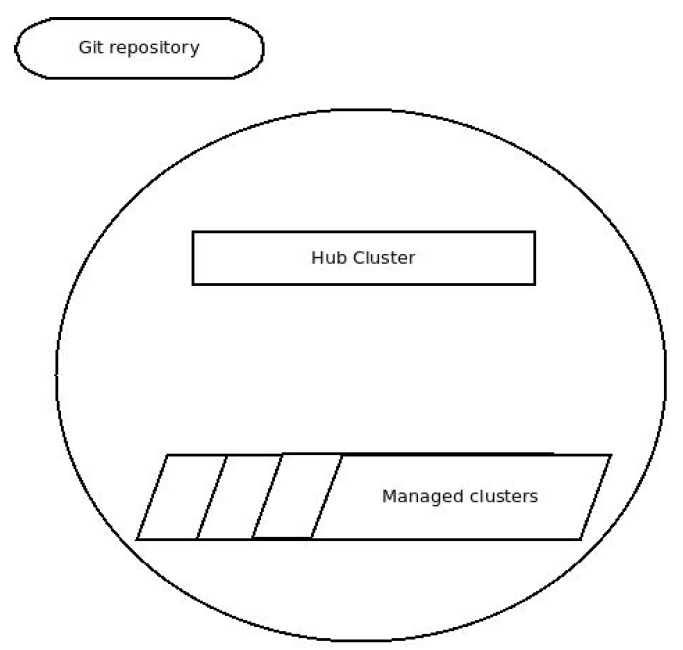
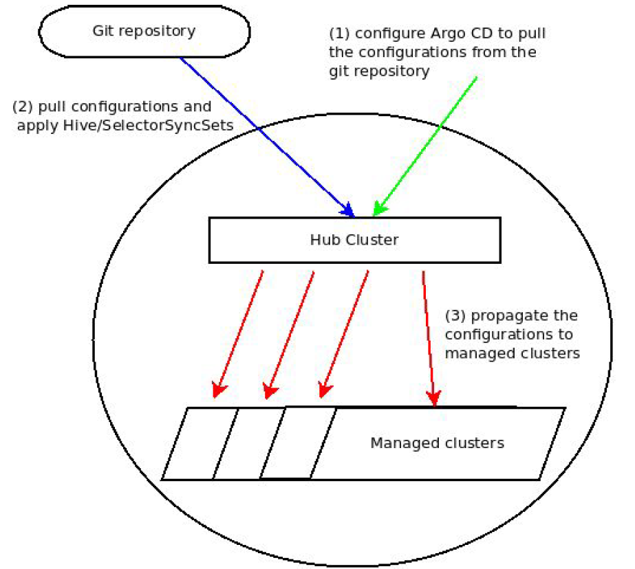

Few months ago I've examined the ability to propagate configurations to Kubernetes clusters in a multi-cluster environment. Here I describe the process and tools in the hope that it will be useful for others that try to do the same thing.

# Background

When we speak about configurations in the context of Kubernetes we typically speak about yaml files that describe how certain resources within the cluster should be defined. For instance, the configuration may include a URL that metrics should be sent to. As another example, the configuration may include all the properties of an application to be deployed to the cluster.  

The GitOps paradigm promotes operating infrastructure using Git. A Git repository holds the state of the infrastructure and operators change the infrastructure using Git operations. For example, a property of one of the entities that comprise the infrastructure (e.g., a node) can be modified by modifying its corresponding resource within the Git repository (e.g., its labels). The GitOps paradigms becomes the common practice for managing the above mentioned configuration for Kubernetes.  

Managing a single Kubernetes cluster using GitOps is relatively easy using tools like Argo CD. Argo CD, maybe the most popular tool for GitOps for Kubernetes nowadays, enables retrieving configuration from a bunch of sources (e.g., GitHub) and applying it to the cluster. The process is pretty straightforward: one needs to deploy Argo CD to the cluster and then define applications that retrieve configuration from a predefined Git repository and apply it to that cluster.  

However, the process becomes more challenging in a multi-cluster environment.  

# Challenges in Multi-Cluster Environments

One of the hot topics in the Kubernetes world today is the management of multi-cluster environments. The [Openshift/Hive project](https://github.com/openshift/hive) enables provisioning clusters as a service. [Advanced Container Management (ACM)](https://www.redhat.com/en/technologies/management/advanced-cluster-management), that was demonstrates in the last Red Hat summit, aims to facilitate various management operations (e.g., application delivery) in a multi-cluster environment.  

When it comes to cluster configuration in a multi-cluster environment, several questions may arise:
* How to propagate the configuration to the clusters? Do we want each cluster to pull its configuration from the Git repository or to propagate the configuration through a hub-cluster (or multiple hub-clusters)?
* Should all configurations get to all clusters or do we want to limit part of the configuration only to certain clusters?
* Do we need to alter the configuration with cluster-specific information (e.g., setting the name of the cluster on metrics that are reported from the cluster; or setting the URL of a hub-cluster that certain clusters should send their metrics to)?

These questions, among others, may suggest that the aforementioned solution for a single-cluster might not be sufficient for a multi-cluster environment.

# Argo CD + Openshit/Hive

We have examined a multi-cluster solution that is based on Argo CD and Openshift/Hive. Conceptually, this solution is similar to the one that was [presented by Worldpay](https://assets.openshift.com/hubfs/Worldpay-fis-openshift-commons_COMMENTS.pptx.pdf) to propagate configuration to Openshift clusters.

This solution assumes the system is composed of one or more hub-clusters and each hub-cluster manages one or more spoke/managed clusters. The spoke/managed clusters are provisioned by Openshift/Hive that runs on the hub-cluster. The configuration to propagate to the clusters resides in a remote Github repository. The next diagram depicts an example of such a system.

In our solution, Argo CD that is deployed to the hub-cluster is defined with an app(s) that retrieves the configuration from the remote Git repository. Then Argo CD pulls the configuration from the remote Git repository, transforms it into Openshift/Hive entities named SelectorSyncSets and finally, Openshift/Hive propagates the SelectorSyncSets to the spoke/managed clusters. The following diagram illustrates this process.

More specifically, we define several applications that are set to pull the configuration from a Git repository on GitHub. These applications are also configured with [custom tools](https://argoproj.github.io/argo-cd/operator-manual/custom_tools/) that transform the pulled configuration into SelectorSyncSets. During the transformation variables within the original configuration can be replaced with details that are specific to a hub or spoke/managed cluster. By using SelectorSyncSets (rather than ordinary SyncSets), the configuration propagates to spoke/managed clusters based on their labels. The label-matching mechanism is the one that is commonly used by Kubernetes. The code transformation code is available [here](https://github.com/ahadas/syncset-gen).  

Using this mechanism we managed to deploy [KubeVirt](https://kubevirt.io/), [Openshift-KNI/Performance-Addon-Operator](https://github.com/openshift-kni/performance-addon-operators), and other Openshift configuration that requires adding and patching Kubernetes entities. The configurations we used are available [here](https://github.com/danielerez/acm-gitops). The beauty in this solution is that it does not rely on a central multi-cluster management application (but relies on provisioning the clusters using Openshift/Hive) and can work for variety of configurations without having to deploy any additional component on the spoke/managed clusters. This mechanism is illustrated in more details in [this recording](https://youtu.be/E4lJSd7Q874).

# Conclusion 

The described solution for configuration management in a multi-cluster Kubernetes-based environment appeared to be useful for propagating a variety of configurations to spoke/managed clusters in our evaluation. For various reasons, the ones that continued that work have decided to embrace alternative approaches. Yet, I think it might be handy for ones that look for a simple and lightweight solution that doesn't involve a centralized management application.
