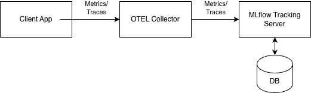

It's been a while since I posted here, but as part of my work on OpenShift AI (that transition could be a topic for another post), I expect to have more interesting content to share. This post covers an exploration I participated in, focused on sending metrics to MLflow for monitoring agentic workflows in production.

# Background

MLflow is known for its capabilities in managing the machine learning lifecycle. [It's part of the Linux Foundation](https://www.linuxfoundation.org/press/press-release/the-mlflow-project-joins-linux-foundation) and as of version 3 of OpenShift AI, it has become a key component for managing experiment tracking and model registry within OpenShift AI.

Our goal was to explore the observability side of MLflow. Specifically, [MLflow already covers the evaluation of production traces](https://mlflow.org/docs/latest/genai/eval-monitor/running-evaluation/traces/), and we wanted to investigate ways to integrate that with OpenShift AI and whether it makes sense to visualize more data on the MLflow console.

# Custom or Standard Solution?

Full compatibility with OpenTelemetry was introduced in MLflow not long before our exploration (at the end of 2025). This left us with the following choices:
  1. Favor MLflow SDK for the best experience.
  2. Favor compatibility with OpenTelemetry for standardization.

Demonstrations we saw using the MLflow SDK were very impressive. While I have no experience working as a data scientist, the out-of-the-box capabilities of the MLflow SDK, such as automatic trace generation by simply adding an annotation, looked appealing.

However, considering the broader picture, we determined it was worth exploring how it could work with OpenTelemetry instead of the MLflow SDK, especially since there are ways to bridge the gaps (e.g., by complying with [OpenInference](https://arize.com/docs/ax/observe/tracing-concepts/what-is-openinference)).

# Having a Central OTEL Collector

There are various ways to integrate MLflow with the typical observability stack in OpenShift. We chose to investigate using an OpenTelemetry collector that would receive traces from different components and export them to the OTEL endpoint in MLflow Tracking Server, as illustrated in the following diagram:



# Simple Export Fails...

The very first attempt to export traces to the OTEL endpoint in MLflow Tracking Server failed with an error: "Workspace context is required for this request". I was already familiar with this error from previous experiments with MLflow and knew it stemmed from an additional layer that was added to verify that a namespace/project is set for the request, which rejected the request.  

I used Claude Code to identify the root cause and come up with a fix. A fix [was posted](https://github.com/opendatahub-io/mlflow/pull/75) and is expected to get included in a future version of OpenShift AI. With that fix, I was able to post traces from within the MLflow pod using:

```bash
curl -i -X POST \
      http://mlflow.opendatahub.svc:9443/v1/traces \
      -H "x-mlflow-experiment-id: 8" \
      -H "x-mlflow-workspace: opendatahub" \
      -H "Authorization: Bearer <token>" \
      -H "Content-Type: application/x-protobuf" \
      -H "x-remote-user: kube:admin" \
      --data-binary @trace.bin
```

# Fixing a Resolved Issue...

Next, I configured an OpenTelemetry collector that can receive traces over gRPC or HTTP and export them to the OTEL endpoint in MLflow Tracking Server:

```yaml
apiVersion: opentelemetry.io/v1beta1
kind: OpenTelemetryCollector
metadata:
  name: collector
  namespace: openshift-monitoring
spec:
  mode: deployment
  config:
    receivers:
      otlp:
        protocols:
          grpc: {}
          http: {}

    processors:
      batch: {}
      resource:
        attributes:
          - key: service.name
            value: "otel-collector-forwarder"
            action: upsert

    exporters:
      otlphttp/mlflow:
        endpoint: "http://mlflow.opendatahub.svc:9443"
        encoding: proto
        compression: none
        headers:
          x-mlflow-experiment-id: "8"
          x-mlflow-workspace: "opendatahub"
          Authorization: "Bearer <token>"
          x-remote-user: "kube:admin"
          Accept: "application/json"
        tls:
          insecure_skip_verify: true

    service:
      pipelines:
        traces:
          receivers: [otlp]
          processors: [resource, batch]
          exporters: [otlphttp/mlflow]
```

With this configuration, a trace I sent to the collector appeared in the MLflow Tracking Server database. However, I noticed it was being sent multiple times until reaching a retry limit. I'll spare you the technical details of the issue [1], as the interesting part is about the fix.  

I thought this could be another issue I could introduce a fix for, so I asked Claude Code to produce one and was about to submit it to [the main MLflow repository](https://github.com/mlflow/mlflow). However, when rebasing, I discovered [the issue had already been fixed there](https://github.com/mlflow/mlflow/commit/6887d3a85ab50659ac78e252983b55c379c56887)! The lesson learned from this is twofold: (A) I'll need to get used to working with midstream repositories, which didn't exist in other projects I've worked on; and (B) Claude Code doesn't appear to check parent repositories even when GitHub integration is enabled.

# Summary

All in all, it was nice to see everything working smoothly eventually, as shown in this demonstration:


It turned out that the above-mentioned architecture considerations weren't that relevant, as many would have seen the OpenTelemetry approach as the preferred option anyway. There were no surprising findings either. However, it was also nice to become more familiar with MLflow and with development processes in OpenShift AI.

[1] For those interested: the response sent by MLflow was encoded in JSON even though the request was encoded in Protobuf, which violated [the OpenTelemetry specification](https://opentelemetry.io/docs/specs/otlp/#otlphttp-response) and resulted in the otelhttp exporter failing to parse the response and attempting to re-export the data repeatedly.
